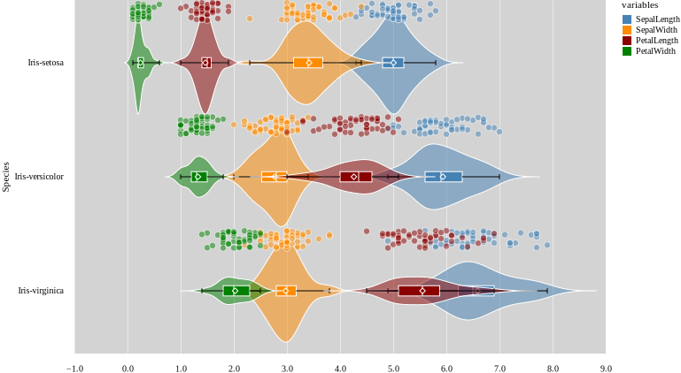
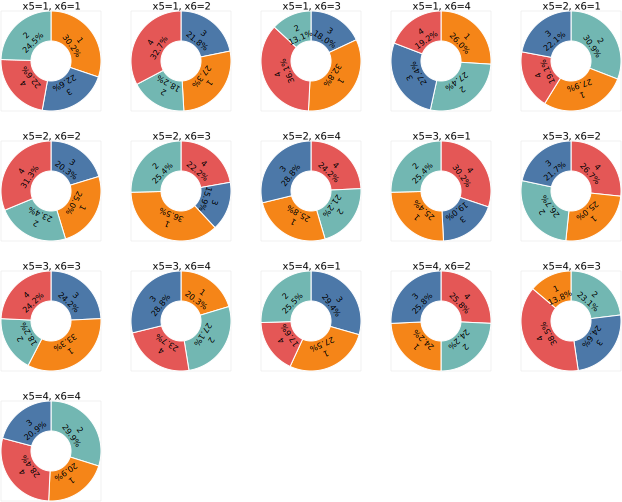
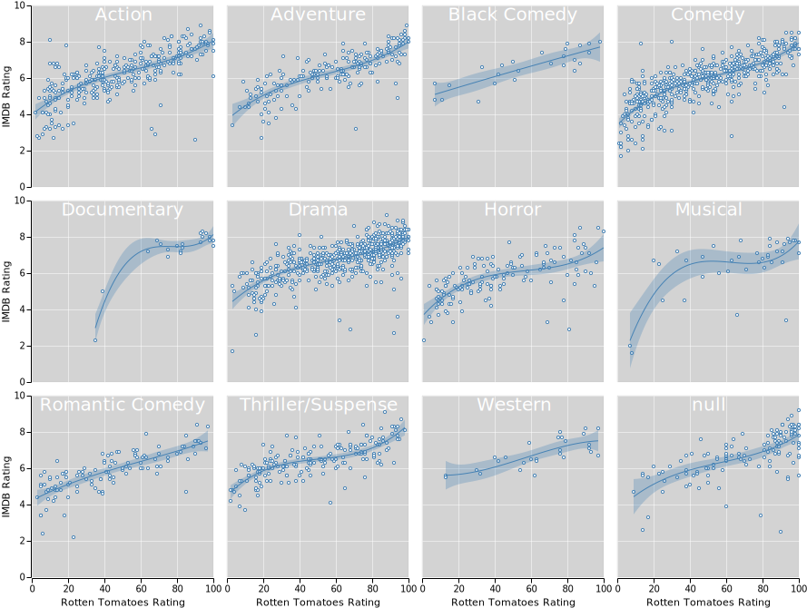
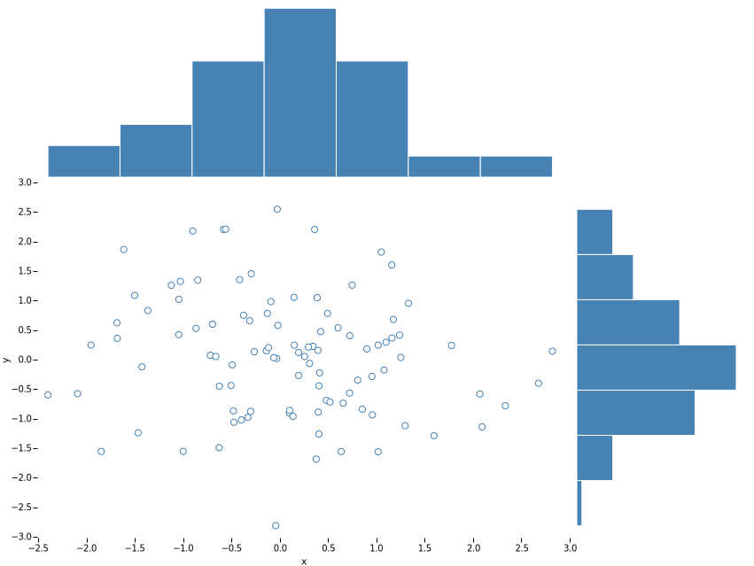

[](https://sl-solution.github.io/StatisticalGraphics.jl/stable/)  [](https://sl-solution.github.io/StatisticalGraphics.jl/dev)


# StatisticalGraphics

The motivation behind the `StatisticalGraphics` package is the desire to develop a powerful, yet easy-to-use solution for creating statistical graphics in Julia. 
The package uses [`vega`](https://vega.github.io/vega/) (see also [D3](https://d3js.org/)) for producing the final outputs.


# Examples

```julia
using StatisticalGraphics
using InMemoryDatasets
ds = Dataset(x=1:100, y=rand(100), y2=rand(100) .+ 5, group=rand(1:2, 100));
sgplot(
        ds,
        [
          Line(x=:x, y=:y2, y2axis=true, group=:group),
          Scatter(x=:x, y=:y2, group=:group)
        ],
        nominal = [:group],
        xaxis = Axis(grid=true),
        yaxis = Axis(grid=true)
      )
```


**Histogram**

Histogram of a column overlaid by kde and fitted normal distribution.

```julia
ds = Dataset(x=randn(100));
sgplot(
        ds,
        [
          Histogram(x=:x, color=:steelblue, outlinethickness=0.5, space=0.5),
          Density(x=:x, type=:kernel, color=:red, fillopacity=0.3),
          Density(x=:x, color=:green, fillopacity=0.3)
        ],
        xaxis = Axis(offset=10, domain=false),
        yaxis = Axis(offset=10, domain=false, grid=true)
      )
```


**Iris Data**

```julia
iris = filereader("assets/iris.csv")
colors = [:steelblue, :darkorange, :darkred, :green]
sgplot(
        iris,
        reduce(vcat,
          [
            [
              Violin(x=i, category=5, color=:white),
              BoxPlot(x=i, category=5, boxwidth=0.1, whiskerdash=[0]),
              Scatter(x=i, y=5, jitter=[0,20], color=colors[i], outlinecolor=:white, opacity=0.5)
            ]
            for i in 1:4
          ]
            ),
        wallcolor=:lightgray,
        xaxis=Axis(offset=10, grid=true, gridcolor=:white, values = -1:9, domain=false, ticksize=0),
        yaxis=Axis(offset=10, padding=0.1, domain=false, ticksize=0),
        groupcolormodel=colors,
        font="Times"
      )
```



**unemployment stacked area plot across industries** 

Reproducing an example from the [`vega`](https://vega.github.io)`s examples collection.

```julia
unemployment = filereader("assets/unemployment_across_industry.csv", types = Dict(2=>Date))
sort!(unemployment, :series, rev=true) # keep alphabetical order
modify!(groupby(unemployment, :date), :count=>cumsum=>:cum_sum)
sort!(unemployment, [:date,:cum_sum], rev=[false,true]) # put the larger areas behind the smaller one 

sgplot(
        unemployment,
        Band(x=:date, lower=0.0, upper=:cum_sum, group=:series, opacity=1),
        nominal = [:series],
        xaxis=Axis(type=:time, nice=false),
        yaxis=Axis(title=""),
        groupcolormodel = Dict(:scheme=>"category20b"),
      )
```


# Examples - grouped datasets

**Cars example**

The following bar chart shows the average horsepower of different cars (bar categories) across different number of cylinders (panel). The color of each bar is computed based on the mean of acceleration inside each group of cars (bar categories) and the bars inside each panel are sorted by the maximum horsepower.

```julia
cars = filereader("assets/cars.csv", types = Dict(9=>Date))
make_fmt(x) = split(x)[1]
setformat!(cars, :Name => make_fmt)
sgplot(
        groupby(cars, :Cylinders), 
        Bar(response=:Horsepower, x=:Name,
            stat=IMD.mean,
            colorresponse=:Acceleration,
            colorstat=IMD.mean,
            orderresponse=:Horsepower,
            orderstat=IMD.maximum,
            outlinethickness=0.5,
            space=0,
            colormodel=["#d53e4f", "#fc8d59", "#fee08b", "#e6f598", "#99d594"]
          ),
          
        layout = :row,
        columnspace = 5,
        linkaxis=:y,
        proportional=true,

        stepsize=15,
        xaxis=Axis(title="Make", angle=-90, baseline=:middle, align=:right, ticksize=0, domain=false, titlepadding=20),
        yaxis=Axis(title="Horsepower", domain=false),
        
        headercolname = false,
        headersize=12,
        headerfontweight=900,
        
        height=400,
      )
```


**usage**

```julia
panel_example = Dataset(rand(1:4, 1000, 10), :auto)
sgplot(
        gatherby(panel_example, [:x3, :x4]), 
        Bar(x=:x1, group=:x2),
        nominal = [:x2],
        layout = :lattice,
        width = 100,
        height = 100
      )
```


**panel**

```julia
sgplot(
        groupby(panel_example, [:x5, :x6]), 
        Pie(category=:x7,
            label=:both,
            labelsize=8,
            innerradius=0.4
          ),
        width = 100,
        height = 100,
        columns=5,
        legend=false
      )
```




```julia
fun_example = Dataset(rand(1:4, 1000, 4), :auto)
sgplot(
        gatherby(fun_example, [:x3, :x4]), 
        Bar(x=:x1, group=:x2, barcorner=15),
        nominal = :x2,
        layout = :lattice,
        rowspace=5,
        columnspace=5,
        width = 100,
        height = 100,
        wallcolor=:lightgray,
        showheaders = false,
        xaxis=Axis(show=false),
        yaxis=Axis(show=false),
        legend=false,
        clip=false
      )
```


**[U-District Cuisine Example](https://vega.github.io/vega/examples/u-district-cuisine/)**

Reproducing an example from the [`vega`](https://vega.github.io)`s examples collection.

```julia
udistrict = filereader("assets/udistrict.csv")
# contains some information - use to customise the appearance
udistrict_info = filereader("assets/udistrict_info.csv", quotechar='"')

# order data
leftjoin!(udistrict, udistrict_info, on = :key)
sort!(udistrict, :order)

# actual graph
sgplot(
        gatherby(udistrict, :names), 

        Density(x=:lat, type=:kernel, bw=0.0005, npoints=200,
                scale=(x; samplesize, args...)->x .* samplesize, # to match the scale in the original example
        
                group=:names,
                grouporder=:data,

                fillopacity=0.7, 
                color=:white
                ),
        yaxis=Axis(show=false),
        xaxis=Axis(title="",
                    grid=true,
                    griddash=[2],
                    values=([47.6516, 47.655363, 47.6584, 47.6614, 47.664924, 47.668519], ["Boat St.", "40th St.", "42nd St.", "45th St.", "50th St.", "55th St."])
                  ),
        
        layout=:column,
        width=800,
        height=70,
        rowspace=-50, # to force overlaps
        panelborder=false,
        
        headercolname=false,
        headerangle=0,
        headerloc=:start,
        headeralign=:left,
        
        # set the font for the whole graph
        font="Times",
        italic=true,
        fontweight=100,
        
        # change default colors
        groupcolormodel=udistrict_info[:, :color],
        
        legend=false
      )
```


**Scatter plot with regression line**

```julia
movies = filereader("assets/movies.csv", dlmstr="::")
using Chain
@chain movies begin
    delete("Major Genre", by = contains("Concert"), missings=false)
    groupby("Major Genre")
    sgplot(
            [
                Scatter(x="Rotten Tomatoes Rating", y="IMDB Rating", size=10),
                Reg(
                      x="Rotten Tomatoes Rating", y="IMDB Rating",
                      degree=3,
                      clm=true,
                    )
            ],
            xaxis=Axis(grid=true,gridcolor=:white),
            yaxis=Axis(grid=true,gridcolor=:white),
            height=200,
            width=200,
            columns=4,
            columnspace=15,
            rowspace=15,
            headercolname=false,
            headeroffset=-20,
            headercolor=:white,
            headersize=20,
            headeritalic=true,
            wallcolor=:lightgray,
            clip=false
          )
end
```



**automatic labelling for Scatter and Bubble plots**

```julia
using Chain
using DLMReader
nations = filereader("assets/nations.csv", emptycolname=true, quotechar='"')
@chain nations begin
  sort([:population, :continent], rev=[true, false]);
  filter(:year, by = ==(2010)); 
  sgplot(
    Bubble(x=:gdpPercap,
           y=:lifeExp,
           colorresponse=:region,
           colormodel=:category,
           size=:population,
           outlinecolor=:white,
           labelresponse=:country,
           labelsize=8,
           labelcolor=:colorresponse,
           maxsize=70,
           tooltip=true
          ),
          clip=false,
          xaxis=Axis(type=:log, nice=false),
      )
end
```


**Polygon example**

```julia
using Chain
triangle(a, mul=[1,1,1]) = [(0.0, 0.0) .* mul[1], (sqrt(2 * a^2 - 2 * a^2 * cos(a)), 0.0) .* mul[2], ((a^2 - a^2 * cos(a)) / sqrt(
    2 * a^2 - 2 * a^2 * cos(a)), (a^2 * sin(a)) / sqrt(2 * a^2 - 2 * a^2 * cos(a))) .* mul[3]]
ds = Dataset(x=range(0.01, 3, step=0.091))
@chain ds begin
  modify!(
            :x => byrow(x->x/10) => :opacity,
            :x => byrow(triangle) => :t1,
            :x => byrow(x->triangle(x, [(1,-1), (1,-1), (3.1,-1)])) => :t2
          )
 
  flatten!(r"^t")

  modify!( 
            :t1 => splitter => [:x1, :y1],
            :t2 => splitter => [:x2, :y2]
          )
  sgplot( 
          [
            Polygon(x="x$i", y="y$i",
                    id=:x,
                    opacityresponse=:opacity,
                    color=:darkgreen,
                    outline=false)
            for i in 1:2
          ],
          height=200,
          width=800,
          xaxis=Axis(show=false),
          yaxis=Axis(show=false)
        )
end
```


## the `sggrid` function

```julia
ds = Dataset(x=randn(100), y=randn(100));
h_x = sgplot(ds, Histogram(x=:x, space=0), xaxis=Axis(show=false), yaxis=Axis(show=false), height=200);
h_y = sgplot(ds, Histogram(y=:y, space=0), xaxis=Axis(show=false), yaxis=Axis(show=false), width=200);
xy = sgplot(ds, Scatter(x=:x, y=:y), xaxis=Axis(domain=false), yaxis=Axis(domain=false));
sggrid(h_x, sggrid(xy, h_y), columns=1)
```


